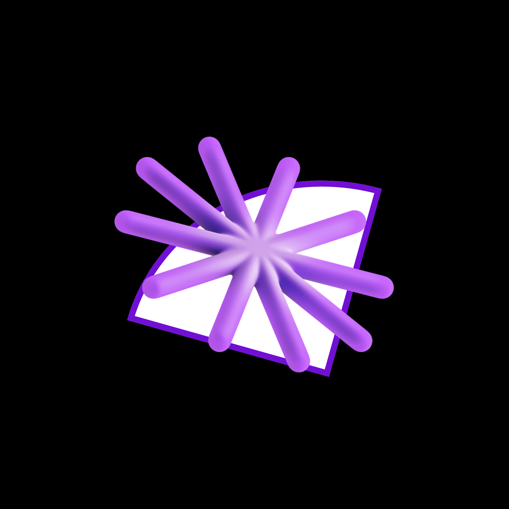
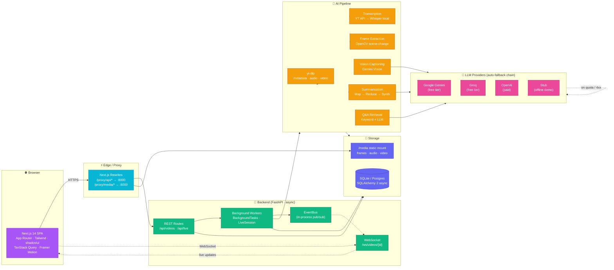
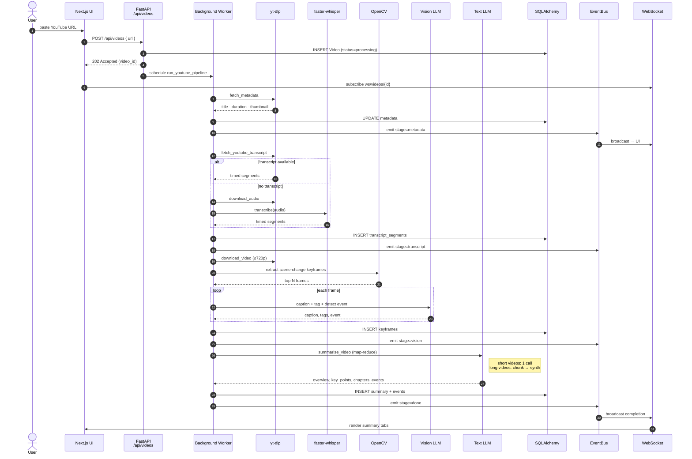
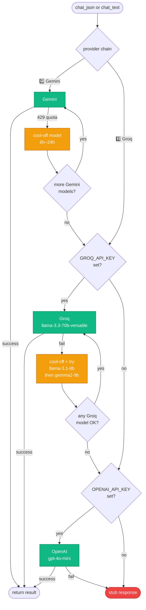
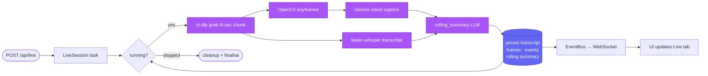
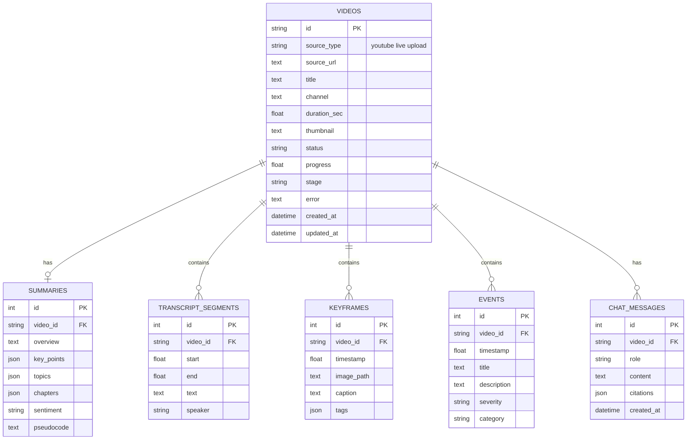

<div align="center">



# VidIQ | AI Video Intelligence

**An end-to-end multimodal AI platform for understanding live and recorded online videos.**

Transcribe, analyse keyframes, summarise, detect events, and converse with any YouTube video or live stream — all from a modern web dashboard.

[](https://www.python.org/)
[](https://fastapi.tiangolo.com/)
[](https://nextjs.org/)
[](https://www.typescriptlang.org/)
[](https://tailwindcss.com/)
[](LICENSE)

[Quick Start](#-quick-start) ·
[Architecture](#-architecture) ·
[API](#-api-reference) ·
[Configuration](#%EF%B8%8F-configuration) ·
[Roadmap](#-roadmap)

</div>

---

## ✨ Overview

VidIQ converts any video — a YouTube URL or a live stream — into structured, queryable intelligence. The platform fuses **speech-to-text**, **vision**, and **large language models** into a single pipeline that produces a faithful summary, time-stamped key points, detected events, and an interactive Q&A grounded in the source.

The system is designed around three principles:

1. **Provider-agnostic** — every external service (LLM, vision, transcription) sits behind an abstraction with automatic failover across providers.
2. **Free-tier first** — the default deployment uses only free services (Google Gemini, Groq, local Whisper, YouTube transcripts).
3. **Production-shaped** — the in-process event bus, queueing, and storage layers are drop-in compatible with Redis, Celery, and PostgreSQL.

---

## 🎯 Capabilities

| Capability | Implementation |
|---|---|
| **Recorded video analysis** | YouTube URL → metadata → transcript → keyframes → vision captions → multimodal summary |
| **Live stream analysis** | Chunked download (yt-dlp) → rolling transcription → rolling vision → rolling LLM summary |
| **Speech understanding** | YouTube native transcripts (primary) → faster-whisper local fallback |
| **Visual understanding** | Scene-change keyframe extraction (OpenCV) → vision-LLM captioning + tagging |
| **Multimodal summarisation** | Map-reduce LLM pipeline producing overview, key points, chapters, sentiment |
| **Event detection** | LLM-extracted demonstrations, claims, definitions, examples + vision-flagged moments |
| **Time-stamped insights** | Every chapter, event, and chat citation seeks the embedded player to the moment |
| **Conversational Q&A** | Retrieval-grounded chat with timestamp citations |
| **Strategy → pseudocode** | Optional pseudocode extraction for tutorial videos |

---

## 🏛 Architecture

### System overview



### Recorded video pipeline



### LLM provider auto-failover



### Live stream pipeline



### Data model



---

## 🛠 Tech Stack

| Layer | Technology |
|---|---|
| **Frontend framework** | Next.js 14 (App Router) · TypeScript 5 · React 18 |
| **Styling** | Tailwind CSS 3 · shadcn/ui-style primitives · Radix UI |
| **State / data** | TanStack Query 5 · WebSocket |
| **Animation** | Framer Motion · CSS keyframes |
| **Backend framework** | FastAPI 0.115 · Uvicorn · Pydantic 2 |
| **ORM / database** | SQLAlchemy 2 (async) · SQLite (dev) · PostgreSQL (prod-ready) |
| **AI — text** | Google Gemini · Groq Llama 3.3 · OpenAI (interchangeable) |
| **AI — vision** | Gemini Vision (extensible to GPT-4o, LLaVA) |
| **AI — speech** | YouTube Transcript API · faster-whisper (local) · OpenAI Whisper (paid) |
| **Video / media** | yt-dlp · OpenCV · static-ffmpeg |
| **Containerisation** | Docker · docker-compose |

---

## 🚀 Quick Start

> **Zero paid API required.** The default configuration uses Google Gemini + Groq (both free tiers) and faster-whisper running locally.

### Prerequisites

- Python **3.10+**
- Node.js **18+**
- A free **Gemini API key** — <https://aistudio.google.com/app/apikey>
- A free **Groq API key** *(recommended fallback)* — <https://console.groq.com/keys>

### Backend

```bash
cd backend
python -m venv .venv

# Windows
.venv\Scripts\activate
# macOS / Linux
source .venv/bin/activate

pip install -r requirements.txt
cp .env.example .env
# → edit .env and paste your free API key(s)

uvicorn app.main:app --host 127.0.0.1 --port 8000 --reload
```

Backend → **http://127.0.0.1:8000** · Swagger UI → **http://127.0.0.1:8000/docs**

### Frontend

```bash
cd frontend
npm install
cp .env.example .env.local

npm run dev
```

UI → **http://localhost:3000**

### Docker (one command)

```bash
GEMINI_API_KEY=your-key GROQ_API_KEY=your-key docker compose up --build
```

---

## ⚙️ Configuration

All backend configuration is environment-driven via `backend/.env`.

### Provider selection

```env
# Primary provider (auto-falls back to others if a key is set)
LLM_PROVIDER=gemini                              # gemini | groq | openai | stub

# Google Gemini (free)
GEMINI_API_KEY=...
GEMINI_MODEL=gemini-flash-latest
GEMINI_VISION_MODEL=gemini-flash-latest

# Groq (free, fast — best fallback)
GROQ_API_KEY=...
GROQ_MODEL=llama-3.3-70b-versatile

# OpenAI (paid, optional)
OPENAI_API_KEY=...
LLM_MODEL=gpt-4o-mini
VISION_MODEL=gpt-4o-mini
```

### Transcription

```env
TRANSCRIPTION_PROVIDER=local                      # local | openai | none
WHISPER_LOCAL_MODEL=tiny                          # tiny | base | small | medium
WHISPER_LOCAL_DEVICE=cpu                          # cpu | cuda
WHISPER_LOCAL_COMPUTE=int8                        # int8 | float16
```

### App

```env
APP_HOST=0.0.0.0
APP_PORT=8000
DATABASE_URL=sqlite+aiosqlite:///./vidiq.db       # postgresql+asyncpg://… in prod
MEDIA_DIR=./media
CORS_ORIGINS=http://localhost:3000
```

---

## 📡 API Reference

| Method | Endpoint | Description |
|---|---|---|
| `GET` | `/api/health` | Service status, configured provider, available models |
| `POST` | `/api/videos` | Start analysis · body `{ url, domain?, extract_pseudocode? }` |
| `GET` | `/api/videos` | List analyses (newest first) |
| `GET` | `/api/videos/{id}` | Full detail — summary, transcript, keyframes, events |
| `DELETE` | `/api/videos/{id}` | Remove analysis + media |
| `GET` | `/api/videos/{id}/chat` | Conversation history |
| `POST` | `/api/videos/{id}/chat` | Ask a question · body `{ message }` |
| `POST` | `/api/live` | Start live-stream session · body `{ url, chunk_seconds }` |
| `POST` | `/api/live/{id}/stop` | Stop a live session |
| `WS` | `/ws/videos/{id}` | Real-time progress + live-chunk events |

Interactive documentation: **http://localhost:8000/docs**

---

## 📁 Project Structure

```
VidIQ/
├── backend/                       FastAPI service + AI pipeline
│   ├── app/
│   │   ├── api/                   REST + WebSocket routes
│   │   │   ├── videos.py
│   │   │   ├── live.py
│   │   │   └── ws.py
│   │   ├── core/                  Config, DB, EventBus, ffmpeg setup
│   │   │   ├── config.py
│   │   │   ├── database.py
│   │   │   ├── events.py
│   │   │   └── ffmpeg_setup.py
│   │   ├── models/                SQLAlchemy 2 ORM
│   │   │   └── video.py
│   │   ├── schemas/               Pydantic DTOs
│   │   │   └── video.py
│   │   ├── services/              Domain logic
│   │   │   ├── llm.py             Multi-provider LLM with rotation
│   │   │   ├── youtube.py         yt-dlp wrappers
│   │   │   ├── frames.py          OpenCV keyframe extraction
│   │   │   ├── summarize.py       Map-reduce summarisation
│   │   │   ├── qa.py              Retrieval-grounded chat
│   │   │   ├── pipeline.py        Recorded-video orchestration
│   │   │   └── live.py            Live-stream orchestration
│   │   └── main.py                FastAPI app + lifespan
│   ├── requirements.txt
│   ├── Dockerfile
│   └── .env.example
│
├── frontend/                      Next.js dashboard
│   ├── src/
│   │   ├── app/                   App Router pages
│   │   │   ├── page.tsx           Dashboard
│   │   │   ├── analyze/           Recorded video form
│   │   │   ├── live/              Live stream form
│   │   │   ├── library/           Past analyses
│   │   │   └── videos/[id]/       Video workspace
│   │   ├── components/
│   │   │   ├── ui/                Primitives (Button, Card, Tabs, …)
│   │   │   ├── layout/            Top nav
│   │   │   ├── dashboard/         Hero CTA, stats, recent grid
│   │   │   ├── marketing/         Feature card, stat strip
│   │   │   ├── fx/                Aurora bg, logo
│   │   │   └── video/             Workspace, panels, chat
│   │   └── lib/                   API client, utils
│   ├── public/                    Logos, static assets
│   ├── tailwind.config.ts
│   ├── package.json
│   ├── Dockerfile
│   └── .env.example
│
├── docker-compose.yml
├── LICENSE
├── .gitignore
└── README.md
```

---

## 🧠 Design Notes

### Provider abstraction
Every external dependency (LLM, vision, transcription) is wrapped in a thin adapter in `app/services/llm.py`. The dispatcher walks a configurable provider chain (`gemini → groq → openai`) and rotates models within a provider when one hits a quota or denial error. A single API failure is invisible to callers.

### Map-reduce summarisation
For long videos, the transcript is chunked into ~4500-char windows. Each chunk is summarised independently (map), then a final synthesis call merges the mini-summaries into the canonical overview, key points, topics, and sentiment (reduce). Chapters are derived from chunk boundaries to avoid an extra LLM round-trip.

### Defensive JSON parsing
LLMs occasionally wrap JSON in markdown fences or emit arrays where objects are expected. `_safe_json()` strips fences, finds the first balanced `{...}` block, and falls back to wrapping arrays — making the pipeline robust to provider quirks.

### Real-time updates
A lightweight in-process pub/sub (`app/core/events.py`) fans pipeline progress events out to subscribed WebSocket clients. The frontend uses `invalidateQueries` on each event so React Query refetches in the background — the UI updates without unmounting components or replaying entry animations.

### Static media serving
Extracted keyframes are written under `MEDIA_DIR` and served via FastAPI's `StaticFiles` mount at `/media/*`. The Next.js rewrite layer proxies these through `/proxy/media/*` so the frontend has zero knowledge of the backend host.

---

## 🗺 Roadmap

### Production hardening
- [ ] PostgreSQL swap (`DATABASE_URL=postgresql+asyncpg://…`)
- [ ] Redis-backed EventBus for multi-worker WebSocket fan-out
- [ ] Celery / RQ / Temporal for distributed pipeline workers
- [ ] S3 / CloudFront for `/media`
- [ ] Authentication (NextAuth + FastAPI JWT) and per-user libraries
- [ ] Per-user rate limits and quotas
- [ ] OpenTelemetry tracing across pipeline stages

### Feature expansion
- [ ] Speaker diarisation (pyannote-audio)
- [ ] Multi-language translation pass
- [ ] Embeddings + semantic transcript search
- [ ] Automatic clip generation from detected events
- [ ] Public share links for analyses
- [ ] Slack / Notion / Linear export integrations

---

## 📄 License

[MIT](LICENSE) © VidIQ contributors