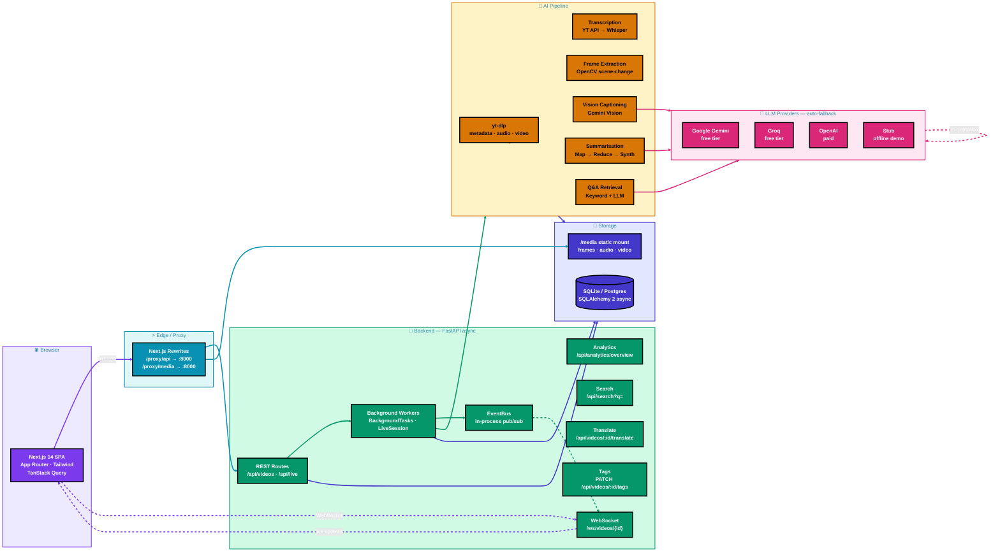
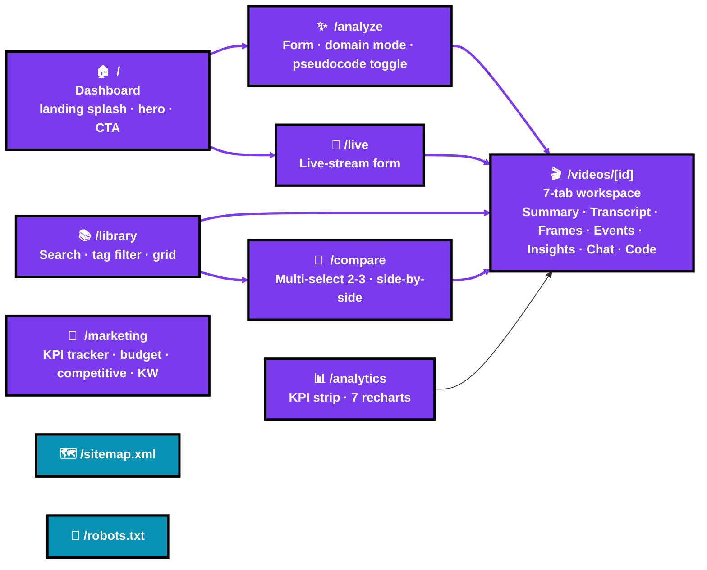
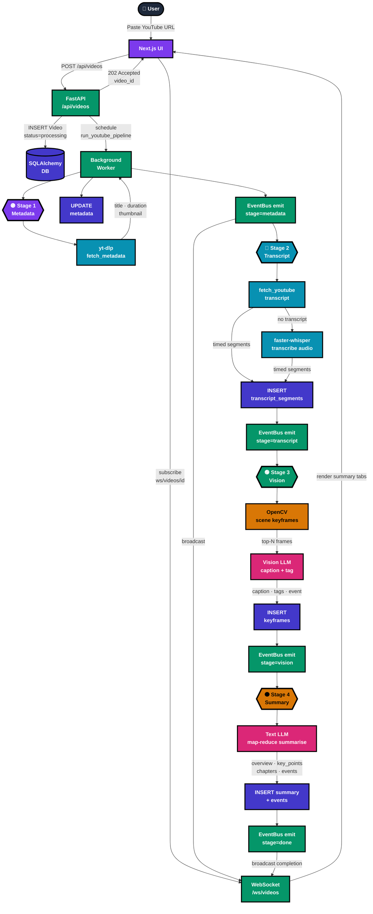
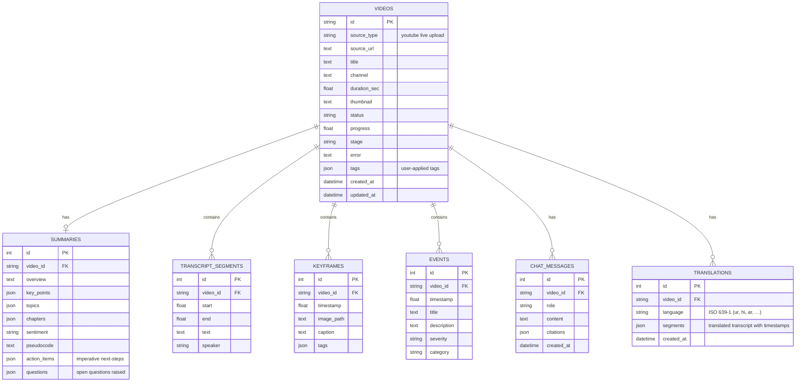
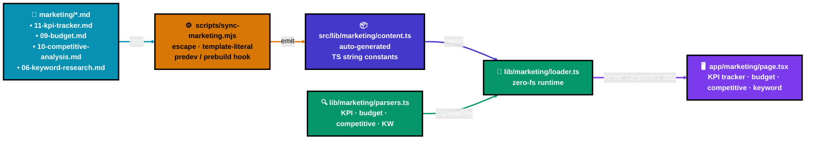

<div align="center">


# VidIQ | AI Video Intelligence

**An end-to-end multimodal AI platform for understanding live and recorded online videos.**

Transcribe, analyse keyframes, summarise, detect events, and converse with any YouTube video or live stream — all from a modern web dashboard.

[](https://vidiq-two.vercel.app)
[](https://huggingface.co/spaces/noumanhafeez11/vidiq-backend)
[](https://www.python.org/)
[](https://fastapi.tiangolo.com/)
[](https://nextjs.org/)
[](https://www.typescriptlang.org/)
[](https://tailwindcss.com/)
[](LICENSE)

[Quick Start](#-quick-start) ·
[Architecture](#-architecture) ·
[API](#-api-reference) ·
[Configuration](#%EF%B8%8F-configuration) ·
[Deployment](#-deployment) ·
[Marketing](#-marketing-project-integration) ·
[Roadmap](#-roadmap)

</div>

---

## ✨ Overview

VidIQ converts any video — a YouTube URL or a live stream — into structured, queryable intelligence. The platform fuses **speech-to-text**, **vision**, and **large language models** into a single pipeline that produces a faithful summary, time-stamped key points, detected events, and an interactive Q&A grounded in the source.

The system is designed around three principles:

1. **Provider-agnostic** — every external service (LLM, vision, transcription) sits behind an abstraction with automatic failover across providers.
2. **Free-tier first** — the default deployment uses only free services (Google Gemini, Groq, local Whisper, YouTube transcripts).
3. **Production-shaped** — the in-process event bus, queueing, and storage layers are drop-in compatible with Redis, Celery, and PostgreSQL.

---

## 🎯 Capabilities

| Capability | Implementation |
|---|---|
| **Recorded video analysis** | YouTube URL → metadata → transcript → keyframes → vision captions → multimodal summary |
| **Live stream analysis** | Chunked download (yt-dlp) → rolling transcription → rolling vision → rolling LLM summary |
| **Speech understanding** | YouTube native transcripts (primary) → faster-whisper local fallback |
| **Visual understanding** | Scene-change keyframe extraction (OpenCV) → vision-LLM captioning + tagging |
| **Multimodal summarisation** | Map-reduce LLM pipeline producing overview, key points, chapters, sentiment |
| **Event detection** | LLM-extracted demonstrations, claims, definitions, examples + vision-flagged moments |
| **Time-stamped insights** | Every chapter, event, and chat citation seeks the embedded player to the moment |
| **Conversational Q&A** | Retrieval-grounded chat with timestamp citations |
| **Strategy → pseudocode** | Optional pseudocode extraction for tutorial videos |
| **Action items + open questions** | LLM extracts imperative next-steps + unresolved questions per analysis |
| **Cross-library analytics** | `/analytics` page — KPI strip + 7 recharts (volume, source mix, status funnel, topics, events, sentiment, durations) with 7/14/30/90-day windows |
| **Per-video Insights tab** | Activity timeline, chapter-word density, keyword frequency, speaker share — all client-side off `VideoDetail` |
| **Side-by-side comparison** | `/compare` — pick 2-3 analyses, multi-series bar chart of metrics + topic overlap (shared / unique sets) |
| **Library search + tagging** | Server-side LIKE search across title/channel/transcript/topics + per-video tag chips with editor + tag-filter row |
| **Transcript translation** | `/api/videos/:id/translate?lang=` — Gemini-driven, 11 languages with RTL support, cached in `translations` table |
| **Marketing project dashboard** | `/marketing` — live KPI tracker, budget breakdown, competitive matrix, sortable keyword research — sourced from `marketing/*.md` |
| **Modern UX layer** | Landing splash · light/dark theme · ⌘K command palette · onboarding tour · top-progress nav bar · skippable kbd shortcuts |
| **Export & share** | Markdown / JSON / Print-to-PDF export per video · copy link · Web Share API |

---

# 🏛 Architecture

## System Overview



---

## Application Surface

The Next.js App Router exposes nine routes — six end-user pages, two SEO endpoints, and one dynamic detail view. Every nav link is eagerly prefetched on top-nav mount so subsequent clicks are essentially instant.



Cross-cutting UX layer (mounted globally in `app/layout.tsx`):

| Component | File | Purpose |
|---|---|---|
| **Landing splash** | `components/fx/landing-splash.tsx` | First-session intro animation on `/` (skippable, respects `prefers-reduced-motion`) |
| **Command palette** | `components/layout/command-palette.tsx` | ⌘K / Ctrl+K — nav · theme · recent videos |
| **Onboarding tour** | `components/layout/onboarding-tour.tsx` | 5-step modal walkthrough on first visit |
| **Theme toggle** | `components/layout/theme-toggle.tsx` | Light / system / dark with `<head>`-injected init script (no FOUC) |
| **Nav progress bar** | `components/layout/nav-progress.tsx` | Top-of-viewport gradient bar on every internal link click |
| **Themed toaster** | `components/layout/themed-toaster.tsx` | Sonner toast with per-theme styling |

---

## Recorded Video Pipeline



---

## LLM Provider Auto-Failover

```mermaid
flowchart TD
    Start([Input: chat_json or chat_text]):::startend --> Chain{Select provider}:::decision

    Chain -->|1 - Try Gemini first| G["Google Gemini"]:::gemini
    G -->|success| Done([Return result]):::startend
    G -->|429 quota exceeded| GR["Cool-off model\n6h to 24h backoff"]:::warn
    GR --> GN{More Gemini\nmodels available?}:::decision
    GN -->|yes| G
    GN -->|no| TryGroq{GROQ_API_KEY set?}:::decision

    Chain -->|2 - Try Groq| TryGroq
    TryGroq -->|yes| Q["Groq\nllama-3.3-70b-versatile"]:::groq
    Q -->|success| Done
    Q -->|fail| QR["Cool-off then try\nllama-3.1-8b\nthen gemma2-9b"]:::warn
    QR --> QN{Any Groq\nmodel OK?}:::decision
    QN -->|yes| Q
    QN -->|no| TryOAI{OPENAI_API_KEY set?}:::decision

    TryGroq -->|no| TryOAI
    TryOAI -->|yes| O["OpenAI\ngpt-4o-mini"]:::openai
    O -->|success| Done
    O -->|fail| Stub
    TryOAI -->|no| Stub(["Stub response\noffline demo"]):::stub

    classDef startend  fill:#1e293b,stroke:#000000,stroke-width:3px,color:#ffffff,font-weight:bold
    classDef decision  fill:#fbbf24,stroke:#000000,stroke-width:3px,color:#000000,font-weight:bold
    classDef gemini    fill:#4285f4,stroke:#000000,stroke-width:3px,color:#ffffff,font-weight:bold
    classDef groq      fill:#7c3aed,stroke:#000000,stroke-width:3px,color:#ffffff,font-weight:bold
    classDef openai    fill:#059669,stroke:#000000,stroke-width:3px,color:#ffffff,font-weight:bold
    classDef warn      fill:#f97316,stroke:#000000,stroke-width:3px,color:#000000,font-weight:bold
    classDef stub      fill:#dc2626,stroke:#000000,stroke-width:3px,color:#ffffff,font-weight:bold

    linkStyle 0  stroke:#94a3b8,stroke-width:3px,color:#ffffff
    linkStyle 1  stroke:#4285f4,stroke-width:3px,color:#ffffff
    linkStyle 2  stroke:#059669,stroke-width:3px,color:#ffffff
    linkStyle 3  stroke:#f97316,stroke-width:3px,color:#ffffff
    linkStyle 4  stroke:#f97316,stroke-width:3px,color:#ffffff
    linkStyle 5  stroke:#4285f4,stroke-width:3px,color:#ffffff
    linkStyle 6  stroke:#94a3b8,stroke-width:3px,color:#ffffff
    linkStyle 7  stroke:#7c3aed,stroke-width:3px,color:#ffffff
    linkStyle 8  stroke:#7c3aed,stroke-width:3px,color:#ffffff
    linkStyle 9  stroke:#059669,stroke-width:3px,color:#ffffff
    linkStyle 10 stroke:#f97316,stroke-width:3px,color:#ffffff
    linkStyle 11 stroke:#f97316,stroke-width:3px,color:#ffffff
    linkStyle 12 stroke:#7c3aed,stroke-width:3px,color:#ffffff
    linkStyle 13 stroke:#94a3b8,stroke-width:3px,color:#ffffff
    linkStyle 14 stroke:#94a3b8,stroke-width:3px,color:#ffffff
    linkStyle 15 stroke:#059669,stroke-width:3px,color:#ffffff
    linkStyle 16 stroke:#059669,stroke-width:3px,color:#ffffff
    linkStyle 17 stroke:#dc2626,stroke-width:3px,color:#ffffff
    linkStyle 18 stroke:#dc2626,stroke-width:3px,color:#ffffff
```



---

## Live Stream Pipeline

```mermaid
flowchart LR
    Start([POST /api/live]):::startend --> Session["LiveSession task"]:::backend
    Session --> Loop{running?}:::decision
    Loop -->|yes| Chunk["yt-dlp\ngrab N-sec chunk"]:::ingest
    Chunk --> Frames["OpenCV\nkeyframes"]:::process
    Chunk --> Audio["faster-whisper\ntranscribe"]:::process
    Frames --> Vision["Gemini Vision\ncaption frame"]:::ai
    Audio --> Roll["LLM\nrolling_summary"]:::ai
    Vision --> Roll
    Roll --> Save[("Persist\ntranscript · frames\nevents · summary")]:::storage
    Save --> Emit["EventBus\nto WebSocket"]:::backend
    Emit --> UI["UI updates\nLive tab"]:::frontend
    Save --> Loop
    Loop -->|stopped| End([Cleanup + finalise]):::startend

    classDef startend  fill:#1e293b,stroke:#000000,stroke-width:3px,color:#ffffff,font-weight:bold
    classDef decision  fill:#fbbf24,stroke:#000000,stroke-width:3px,color:#000000,font-weight:bold
    classDef ingest    fill:#0891b2,stroke:#000000,stroke-width:3px,color:#ffffff,font-weight:bold
    classDef process   fill:#d97706,stroke:#000000,stroke-width:3px,color:#000000,font-weight:bold
    classDef ai        fill:#db2777,stroke:#000000,stroke-width:3px,color:#ffffff,font-weight:bold
    classDef backend   fill:#059669,stroke:#000000,stroke-width:3px,color:#ffffff,font-weight:bold
    classDef storage   fill:#4338ca,stroke:#000000,stroke-width:3px,color:#ffffff,font-weight:bold
    classDef frontend  fill:#7c3aed,stroke:#000000,stroke-width:3px,color:#ffffff,font-weight:bold

    linkStyle 0  stroke:#059669,stroke-width:3px,color:#ffffff
    linkStyle 1  stroke:#059669,stroke-width:3px,color:#ffffff
    linkStyle 2  stroke:#fbbf24,stroke-width:3px,color:#000000
    linkStyle 3  stroke:#0891b2,stroke-width:3px
    linkStyle 4  stroke:#0891b2,stroke-width:3px
    linkStyle 5  stroke:#db2777,stroke-width:3px
    linkStyle 6  stroke:#db2777,stroke-width:3px
    linkStyle 7  stroke:#db2777,stroke-width:3px
    linkStyle 8  stroke:#4338ca,stroke-width:3px
    linkStyle 9  stroke:#059669,stroke-width:3px
    linkStyle 10 stroke:#7c3aed,stroke-width:3px
    linkStyle 11 stroke:#fbbf24,stroke-width:3px,stroke-dasharray:6,color:#ffffff
    linkStyle 12 stroke:#94a3b8,stroke-width:3px,color:#ffffff
```



### Data model



> Schema migrations on existing SQLite DBs are handled by an idempotent
> startup helper in `app/core/database.py` — it inspects each table via
> `PRAGMA table_info` and runs `ALTER TABLE ADD COLUMN` only for missing
> columns. New analyses pick up `action_items`, `questions`, and `tags`
> automatically; old analyses get the columns added with empty defaults.

---

## 🛠 Tech Stack

| Layer | Technology |
|---|---|
| **Frontend framework** | Next.js 14 (App Router) · TypeScript 5 · React 18 |
| **Styling** | Tailwind CSS 3 · shadcn/ui-style primitives · Radix UI |
| **State / data** | TanStack Query 5 · WebSocket |
| **Animation** | Framer Motion · CSS keyframes |
| **Charts / data viz** | recharts 2 (analytics page · per-video Insights · compare · marketing dashboard) |
| **Markdown** | react-markdown · remark-gfm (transcript rendering) |
| **Backend framework** | FastAPI 0.115 · Uvicorn · Pydantic 2 |
| **ORM / database** | SQLAlchemy 2 (async) · SQLite (dev) · PostgreSQL (prod-ready) |
| **AI — text** | Google Gemini · Groq Llama 3.3 · OpenAI (interchangeable) |
| **AI — vision** | Gemini Vision (extensible to GPT-4o, LLaVA) |
| **AI — speech** | YouTube Transcript API · faster-whisper (local) · OpenAI Whisper (paid) |
| **Video / media** | yt-dlp · OpenCV · static-ffmpeg |
| **Containerisation** | Docker · docker-compose · Hugging Face Spaces (Docker SDK) |
| **Hosting (production)** | Vercel (frontend) · Hugging Face Spaces (backend) — both free tier |
| **CI** | GitHub Actions — `marketing-branch` → `main` auto-merge workflow |

---

## 🚀 Quick Start

> **Zero paid API required.** The default configuration uses Google Gemini + Groq (both free tiers) and faster-whisper running locally.

### Prerequisites

- Python **3.10+**
- Node.js **18+**
- A free **Gemini API key** — <https://aistudio.google.com/app/apikey>
- A free **Groq API key** *(recommended fallback)* — <https://console.groq.com/keys>

### Backend

```bash
cd backend
python -m venv .venv

# Windows
.venv\Scripts\activate
# macOS / Linux
source .venv/bin/activate

pip install -r requirements.txt
cp .env.example .env
# → edit .env and paste your free API key(s)

uvicorn app.main:app --host 127.0.0.1 --port 8000 --reload
```

Backend → **http://127.0.0.1:8000** · Swagger UI → **http://127.0.0.1:8000/docs**

### Frontend

```bash
cd frontend
npm install
cp .env.example .env.local

npm run dev
```

UI → **http://localhost:3000**

### Docker (one command)

```bash
GEMINI_API_KEY=your-key GROQ_API_KEY=your-key docker compose up --build
```

---

## ☁️ Deployment

VidIQ runs on a **two-host, $0 / month** topology:

| Layer | Host | URL |
|---|---|---|
| Frontend (Next.js) | **Vercel** (Hobby) | <https://vidiq-two.vercel.app> |
| Backend (FastAPI) | **Hugging Face Spaces** (Docker SDK, CPU-basic) | <https://noumanhafeez11-vidiq-backend.hf.space> |



```mermaid
flowchart LR
    Browser["🌐 Browser"]:::client
    Vercel["⚡ Vercel\nNext.js · static + SSR\nvidiq-two.vercel.app"]:::edge
    HF["🤗 Hugging Face Space\nFastAPI · uvicorn · ffmpeg\nfaster-whisper · OpenCV\nnoumanhafeez11-vidiq-backend.hf.space"]:::backend
    APIs["🧠 Free APIs\nGemini · Groq · YT Transcript"]:::llm

    Browser -->|"HTTPS"| Vercel
    Vercel -->|"/proxy/api/*  →  rewrite"| HF
    Vercel -->|"/proxy/media/*  →  rewrite"| HF
    HF -->|"prompt + frames + transcript"| APIs

    classDef client   fill:#7c3aed,stroke:#000000,stroke-width:3px,color:#ffffff,font-weight:bold
    classDef edge     fill:#0891b2,stroke:#000000,stroke-width:3px,color:#ffffff,font-weight:bold
    classDef backend  fill:#059669,stroke:#000000,stroke-width:3px,color:#ffffff,font-weight:bold
    classDef llm      fill:#db2777,stroke:#000000,stroke-width:3px,color:#ffffff,font-weight:bold

    linkStyle 0 stroke:#7c3aed,stroke-width:3px,color:#ffffff
    linkStyle 1 stroke:#0891b2,stroke-width:3px,color:#ffffff
    linkStyle 2 stroke:#0891b2,stroke-width:3px,color:#ffffff,stroke-dasharray:6
    linkStyle 3 stroke:#db2777,stroke-width:3px,color:#ffffff
```

### Why this split

| Concern | Vercel | HF Spaces (vs Render) |
|---|---|---|
| Stack fit | Native Next.js · CDN edge | Docker SDK · works with `backend/Dockerfile` unchanged |
| Cold start | None | None (HF doesn't sleep idle Spaces — Render free does, 30-45 s wake) |
| RAM | n/a (static + SSR) | **16 GB** (vs Render free's 512 MB — Whisper-tiny + OpenCV + ffmpeg fits comfortably) |
| Cost | $0 | $0 |
| Deploy | `vercel --prod` from `frontend/` | `git push` to the Space repo |
| Hostname | `*.vercel.app` (free) | `*.hf.space` (free) |

### Production wiring

| Surface | Setting | Value |
|---|---|---|
| Vercel project | **Root Directory** | `frontend` |
| Vercel project | **Install Command** | `npm install --legacy-peer-deps` (`.npmrc` already pinned) |
| Vercel env | `NEXT_PUBLIC_API_URL` | `https://noumanhafeez11-vidiq-backend.hf.space` |
| Vercel env | `NEXT_PUBLIC_SITE_URL` | `https://vidiq-two.vercel.app` |
| HF Space frontmatter | `app_port` | `7860` (matches `${PORT:-8000}` runtime override) |
| HF Space env | `CORS_ORIGINS` | `https://vidiq-two.vercel.app` |
| HF Space secrets | `GEMINI_API_KEY` · `GROQ_API_KEY` | (provider tokens) |
| HF Space variables | model + transcription config | mirrors `backend/.env.example` |

### Deploy commands

```bash
# Frontend (Vercel)
cd frontend
npx vercel --prod                  # uploads local build context, runs next build on Vercel

# Backend (Hugging Face Space)
cd ~ && git clone https://huggingface.co/spaces/<user>/vidiq-backend hf-space
cp -r /path/to/VidIQ/backend/. hf-space/
cd hf-space && git add . && git commit -m "deploy" && git push
```

The first HF Space build takes ~5-8 min (downloading ffmpeg + OpenCV + Whisper-tiny). Subsequent pushes redeploy in ~2 min.

> **Known caveat — YouTube cloud-IP blocking.** Hugging Face Space IPs are
> rate-limited by YouTube's anti-bot check. Production analyses of YouTube
> URLs may fail with `Sign in to confirm you're not a bot`. This is a
> yt-dlp + cloud-host limitation, not a code bug. For live demos use a
> local backend (residential IP), or use a non-YouTube source (Vimeo,
> direct mp4, podcast feed) — yt-dlp scrapes those normally.

---

## 📣 Marketing Project Integration

VidIQ doubles as the deliverable for a **Digital Marketing project** spanning five rubric pillars. The `marketing/` folder contains 14 self-contained markdown deliverables plus a generator for the final presentation deck:

| Pillar | Marketing artefact | Surfaced in app |
|---|---|---|
| **1 — Branding** | `01-brand-guide.md` · `02-video-ad-script.md` | Logo · palette · type baked into every page |
| **2 — Social** | `03-content-calendar.md` · `04-meta-ads-plan.md` · `05-social-templates.md` | (out of app — slide deck only) |
| **3 — Product** | The web app itself | Live at <https://vidiq-two.vercel.app> |
| **4 — SEO/SEM** | `06-keyword-research.md` · `07-onpage-seo-report.md` · `08-google-ads-plan.md` | `/sitemap.xml` · `/robots.txt` · JSON-LD · per-page meta |
| **5 — Competitive + KPI** | `09-budget.md` · `10-competitive-analysis.md` · `11-kpi-tracker.md` | `/marketing` route renders all four |

### Marketing dashboard data flow



### Marketing surface summary

| Component on `/marketing` | Source MD | Visualisation |
|---|---|---|
| **KPI tracker** | `11-kpi-tracker.md` | Per-pillar collapsible groups · animated progress bars · status chips · summary scorecard (4.83 / 5) |
| **Budget breakdown** | `09-budget.md` | recharts donut · planned/actual toggle · categorised line-item table · share bars |
| **Competitive matrix** | `10-competitive-analysis.md` | Tabbed comparison (Company / Facebook / Instagram / Other / Website) + 3-col SWOT + opps/threats |
| **Keyword research** | `06-keyword-research.md` | Sortable table · MSV bars · KD bars (green/amber/rose by difficulty) · intent badges · short/long-tail filter · search |

### Final presentation deck

`marketing/build_deck.py` uses `python-pptx` to generate a 16-slide branded `.pptx` (one per `12-presentation-outline.md` blueprint) at `marketing/submissions/VidIQ_Final_Presentation.pptx`. Brand fonts (Plus Jakarta Sans / Inter / JetBrains Mono), brand palette, speaker notes per slide, ready to import to **Canva** (`Create → Upload → drag the .pptx`) or open in PowerPoint / Keynote.

```bash
python marketing/build_deck.py
# → marketing/submissions/VidIQ_Final_Presentation.pptx (16 slides)
```

---

## ⚙️ Configuration

All backend configuration is environment-driven via `backend/.env`.

### Provider selection

```env
# Primary provider (auto-falls back to others if a key is set)
LLM_PROVIDER=gemini                              # gemini | groq | openai | stub

# Google Gemini (free)
GEMINI_API_KEY=...
GEMINI_MODEL=gemini-flash-latest
GEMINI_VISION_MODEL=gemini-flash-latest

# Groq (free, fast — best fallback)
GROQ_API_KEY=...
GROQ_MODEL=llama-3.3-70b-versatile

# OpenAI (paid, optional)
OPENAI_API_KEY=...
LLM_MODEL=gpt-4o-mini
VISION_MODEL=gpt-4o-mini
```

### Transcription

```env
TRANSCRIPTION_PROVIDER=local                      # local | openai | none
WHISPER_LOCAL_MODEL=tiny                          # tiny | base | small | medium
WHISPER_LOCAL_DEVICE=cpu                          # cpu | cuda
WHISPER_LOCAL_COMPUTE=int8                        # int8 | float16
```

### App

```env
APP_HOST=0.0.0.0
APP_PORT=8000
DATABASE_URL=sqlite+aiosqlite:///./vidiq.db       # postgresql+asyncpg://… in prod
MEDIA_DIR=./media
CORS_ORIGINS=http://localhost:3000
```

---

## 📡 API Reference

| Method | Endpoint | Description |
|---|---|---|
| `GET` | `/api/health` | Service status, configured provider, available models |
| `POST` | `/api/videos` | Start analysis · body `{ url, domain?, extract_pseudocode? }` |
| `GET` | `/api/videos` | List analyses (newest first) |
| `GET` | `/api/videos/{id}` | Full detail — summary (incl. action_items + questions), transcript, keyframes, events, tags |
| `DELETE` | `/api/videos/{id}` | Remove analysis + media |
| `PATCH` | `/api/videos/{id}/tags` | Update tags · body `{ tags: string[] }` (sanitised, max 12 × 32 chars) |
| `POST` | `/api/videos/{id}/translate` | Translate transcript · query `lang=ur&refresh=false` (cached in `translations` table) |
| `GET` | `/api/videos/{id}/chat` | Conversation history |
| `POST` | `/api/videos/{id}/chat` | Ask a question · body `{ message }` |
| `POST` | `/api/live` | Start live-stream session · body `{ url, chunk_seconds }` |
| `POST` | `/api/live/{id}/stop` | Stop a live session |
| `GET` | `/api/analytics/overview` | Aggregated KPIs + breakdowns · query `days=30` (1-365) |
| `GET` | `/api/search` | Cross-library LIKE search across title / channel / transcript / topics · query `q=&limit=20` |
| `WS` | `/ws/videos/{id}` | Real-time progress + live-chunk events |

Interactive documentation: **http://localhost:8000/docs**

---

## 📁 Project Structure

```
VidIQ/
├── backend/                       FastAPI service + AI pipeline
│   ├── app/
│   │   ├── api/                   REST + WebSocket routes
│   │   │   ├── videos.py          analyze · detail · chat · tags · translate
│   │   │   ├── live.py
│   │   │   ├── ws.py
│   │   │   ├── analytics.py       /api/analytics/overview (KPIs + 7 series)
│   │   │   └── search.py          /api/search?q= cross-library LIKE search
│   │   ├── core/                  Config, DB, EventBus, ffmpeg setup
│   │   │   ├── config.py          absolute-path .env loading (cwd-independent)
│   │   │   ├── database.py        async engine + idempotent ALTER TABLE migrator
│   │   │   ├── events.py
│   │   │   └── ffmpeg_setup.py
│   │   ├── models/                SQLAlchemy 2 ORM
│   │   │   └── video.py           Video · Summary · Translation · Keyframe · Event · TranscriptSegment · ChatMessage
│   │   ├── schemas/               Pydantic DTOs
│   │   │   └── video.py           + TagsUpdate · TranslationResponse · SearchResponse
│   │   ├── services/              Domain logic
│   │   │   ├── llm.py             Multi-provider LLM with rotation
│   │   │   ├── youtube.py         yt-dlp wrappers
│   │   │   ├── frames.py          OpenCV keyframe extraction
│   │   │   ├── summarize.py       Map-reduce summarisation + action_items + questions
│   │   │   ├── translate.py       Chunked transcript translation via Gemini
│   │   │   ├── qa.py              Retrieval-grounded chat
│   │   │   ├── pipeline.py        Recorded-video orchestration
│   │   │   └── live.py            Live-stream orchestration
│   │   └── main.py                FastAPI app + lifespan
│   ├── requirements.txt
│   ├── Dockerfile                 honours ${PORT:-8000} (HF · Render · local)
│   ├── README.md                  HF Space metadata (sdk: docker)
│   └── .env.example
│
├── frontend/                      Next.js dashboard
│   ├── src/
│   │   ├── app/                   App Router pages
│   │   │   ├── page.tsx           Dashboard (with landing splash on /)
│   │   │   ├── analyze/           Recorded video form
│   │   │   ├── live/              Live stream form
│   │   │   ├── library/           Past analyses · search · tag filter
│   │   │   ├── compare/           Side-by-side 2-3 video comparison
│   │   │   ├── analytics/         KPI strip + 7 recharts
│   │   │   ├── marketing/         Marketing-project dashboard (server component)
│   │   │   ├── videos/[id]/       Video workspace (7-tab)
│   │   │   ├── robots.ts          /robots.txt generator
│   │   │   └── sitemap.ts         /sitemap.xml generator
│   │   ├── components/
│   │   │   ├── ui/                Primitives (Button, Card, Tabs, …)
│   │   │   ├── layout/            Top nav · theme toggle · command palette · onboarding · nav progress · themed toaster
│   │   │   ├── dashboard/         Hero CTA, stats, recent grid (with tag chips + snippet)
│   │   │   ├── marketing/         Feature card · stat strip · KPI tracker · budget · competitive · keyword
│   │   │   ├── analytics/         chart-shell · charts · kpi-strip
│   │   │   ├── compare/           compare-grid (cards + bar chart + topic overlap)
│   │   │   ├── fx/                Aurora bg · logo · landing-splash · seo-jsonld
│   │   │   └── video/             Workspace · panels · chat · share-menu · tag-editor · insights-panel · workspace-tabs
│   │   └── lib/
│   │       ├── api.ts             API client (analytics · search · translate · tags · export)
│   │       ├── theme.tsx          ThemeProvider + FOUC-safe init script
│   │       ├── export.ts          Markdown / JSON serialisation + download trigger
│   │       └── marketing/         loader · parsers · types · content (auto-generated)
│   ├── public/                    Logos (PNG + SVG), favicon, OG images
│   ├── scripts/
│   │   └── sync-marketing.mjs     Inlines marketing/*.md → src/lib/marketing/content.ts
│   ├── tailwind.config.ts
│   ├── package.json               + predev/prebuild → sync-marketing
│   ├── .npmrc                     legacy-peer-deps=true (Vercel/CI compat)
│   ├── next.config.mjs            /proxy/api/* + /proxy/media/* rewrite (whitespace-tolerant)
│   ├── Dockerfile
│   └── .env.example
│
├── marketing/                     Digital-Marketing project deliverables (Pillars 1-5)
│   ├── 01-brand-guide.md
│   ├── 02-video-ad-script.md
│   ├── 03-content-calendar.md
│   ├── 04-meta-ads-plan.md
│   ├── 05-social-templates.md
│   ├── 06-keyword-research.md
│   ├── 07-onpage-seo-report.md
│   ├── 08-google-ads-plan.md
│   ├── 09-budget.md
│   ├── 10-competitive-analysis.md
│   ├── 11-kpi-tracker.md
│   ├── 12-presentation-outline.md
│   ├── 13-self-do-checklist.md
│   ├── 14-vercel-deployment.md
│   ├── 15-deployment-evidence.md
│   ├── build_deck.py              python-pptx generator → 16-slide branded deck
│   ├── submissions/
│   │   └── VidIQ_Final_Presentation.pptx
│   └── README.md
│
├── data/                          Project brief + KPI/competitive xlsx
│   ├── Project.docx               Rubric brief
│   ├── DM_Competitive_KPI.xlsx    Filled (Sections A-D + 18 KPI rows)
│   └── fill_xlsx.py               Regenerates xlsx from MDs
│
├── .github/workflows/
│   └── auto-merge.yml             marketing-branch → main fast-forward action
│
├── docker-compose.yml
├── LICENSE
├── .gitignore
└── README.md
```

---

## 🧠 Design Notes

### Provider abstraction
Every external dependency (LLM, vision, transcription) is wrapped in a thin adapter in `app/services/llm.py`. The dispatcher walks a configurable provider chain (`gemini → groq → openai`) and rotates models within a provider when one hits a quota or denial error. A single API failure is invisible to callers.

### Map-reduce summarisation
For long videos, the transcript is chunked into ~4500-char windows. Each chunk is summarised independently (map), then a final synthesis call merges the mini-summaries into the canonical overview, key points, topics, and sentiment (reduce). Chapters are derived from chunk boundaries to avoid an extra LLM round-trip. The same prompts now also extract `action_items` (imperative next-steps) and `questions` (open questions raised) — surfaced as dedicated cards on the Summary tab.

### Defensive JSON parsing
LLMs occasionally wrap JSON in markdown fences or emit arrays where objects are expected. `_safe_json()` strips fences, finds the first balanced `{...}` block, and falls back to wrapping arrays — making the pipeline robust to provider quirks.

### Real-time updates
A lightweight in-process pub/sub (`app/core/events.py`) fans pipeline progress events out to subscribed WebSocket clients. The frontend uses `invalidateQueries` on each event so React Query refetches in the background — the UI updates without unmounting components or replaying entry animations.

### Static media serving
Extracted keyframes are written under `MEDIA_DIR` and served via FastAPI's `StaticFiles` mount at `/media/*`. The Next.js rewrite layer proxies these through `/proxy/media/*` so the frontend has zero knowledge of the backend host.

### Filesystem-free marketing dashboard
The `/marketing` page reads from `frontend/src/lib/marketing/content.ts` — a build-time generated TypeScript module that inlines `marketing/*.md` as string constants. No `fs.readFile` at request time, no dependency on Vercel "Include outside files" toggles, no path-resolution gymnastics. Edits to source MDs at the repo root flow into the bundle via `npm run sync-marketing` (auto-fires on `predev` and `prebuild`).

### Idempotent SQLite migrations
`init_db()` runs on every backend startup and applies missing columns via `PRAGMA table_info` + `ALTER TABLE ADD COLUMN`. New analyses get `tags`, `action_items`, `questions` automatically; pre-existing analyses get the columns added with empty defaults. No external migration tool, no Alembic config — appropriate for the project's free-tier-first ethos.

### Whitespace-tolerant rewrites
`next.config.mjs` strips leading/trailing whitespace and trailing slashes from `NEXT_PUBLIC_API_URL` and prepends `https://` when missing. This survives clipboard-paste accidents, env-var GUI bugs, and copy-from-docs mishaps that would otherwise produce `Invalid URL` build errors during deploy.

### Eager nav prefetch
`TopNav` fires `router.prefetch()` for every nav target on mount via `requestIdleCallback`, with a belt-and-braces `onMouseEnter` re-prefetch per link. Combined with the global `NavigationProgress` bar (which appears the instant any internal link is clicked), this makes route changes feel instant even on cold caches.

### Light-mode contrast pass
The dark-first design uses tinted text classes (`text-violet-200`, `text-cyan-100`, etc.) on tinted backgrounds — invisible on a white canvas. Rather than touch every component, `globals.css` adds `html:not(.dark) .text-violet-200 { color: <-800 shade> !important }` rules across 16 colour families. Tint-badge readability is solved globally with one CSS layer.

### Auto-merge `marketing-branch` → `main`
A GitHub Action (`.github/workflows/auto-merge.yml`) listens for pushes to `marketing-branch` and fast-forwards `main` to match (or no-FF merges if histories diverged). Iterating happens on `marketing-branch`; `main` is always the deployed truth. No PRs needed for routine work.

---

## 🗺 Roadmap

### Recently shipped
- [x] **Cross-library analytics** — KPIs + 7 recharts (`/analytics`) + backend `GET /api/analytics/overview`
- [x] **Per-video Insights tab** — activity timeline, chapter-word density, keyword frequency, speaker share
- [x] **Side-by-side comparison** (`/compare`) — pick 2-3, multi-series bar chart + topic overlap
- [x] **Library search + tagging** — `GET /api/search` + `PATCH /api/videos/:id/tags` + tag chip editor
- [x] **Multi-language translation pass** — `POST /api/videos/:id/translate?lang=` (11 languages, RTL, cached)
- [x] **Action items + open questions** — extracted by the same map-reduce summariser
- [x] **Marketing project dashboard** (`/marketing`) — KPI / budget / competitive / KW from `marketing/*.md`
- [x] **Public share links** — frontend share menu with copy-link · Web Share API · Print-to-PDF
- [x] **Modern UX layer** — landing splash · ⌘K command palette · onboarding tour · light/dark theme · nav-progress bar
- [x] **Production deployment** — Vercel (frontend) + Hugging Face Space (backend), $0 / month
- [x] **CI** — `marketing-branch` → `main` GitHub Action auto-merge

### Production hardening
- [ ] PostgreSQL swap (`DATABASE_URL=postgresql+asyncpg://…`)
- [ ] Redis-backed EventBus for multi-worker WebSocket fan-out
- [ ] Celery / RQ / Temporal for distributed pipeline workers
- [ ] S3 / CloudFront for `/media`
- [ ] Authentication (NextAuth + FastAPI JWT) and per-user libraries
- [ ] Per-user rate limits and quotas
- [ ] OpenTelemetry tracing across pipeline stages
- [ ] Persistent disk on HF Space (currently ephemeral on free tier)
- [ ] yt-dlp cookies workaround for cloud-IP YouTube anti-bot

### Feature expansion
- [ ] Speaker diarisation (pyannote-audio)
- [ ] Embeddings + semantic transcript search (replace LIKE-based search)
- [ ] OCR on keyframes (Tesseract or Gemini-vision second pass)
- [ ] Automatic clip generation from detected events
- [ ] Slack / Notion / Linear export integrations
- [ ] Audio-only sources (podcasts, mp3 URLs) — first-class support
- [ ] Multi-tenant tag namespaces

---

## 📄 License

[MIT](LICENSE) © VidIQ contributors